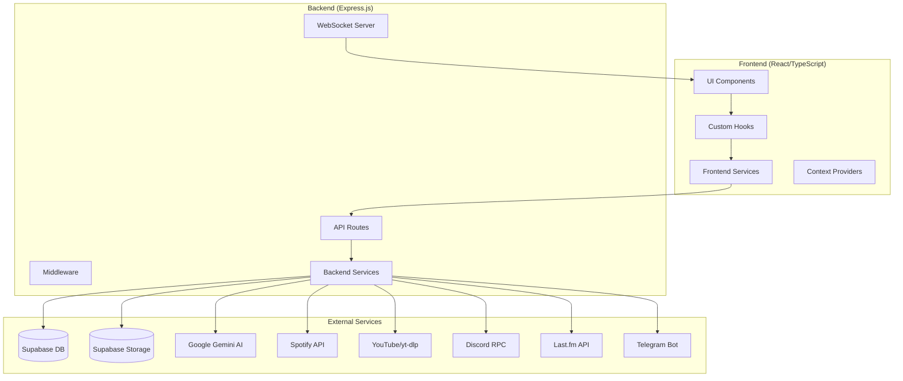
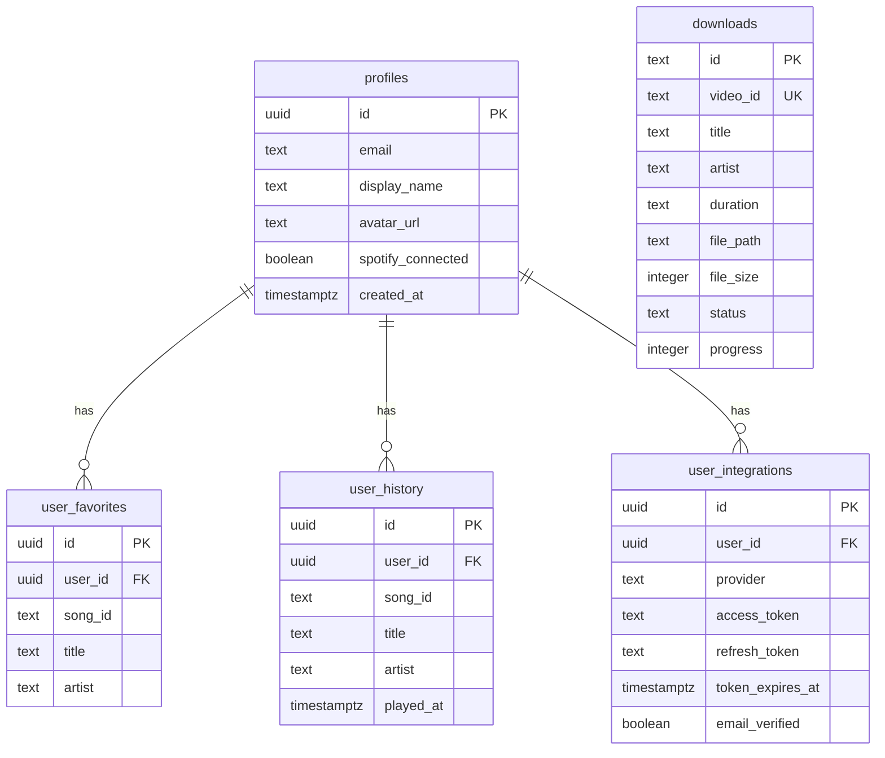
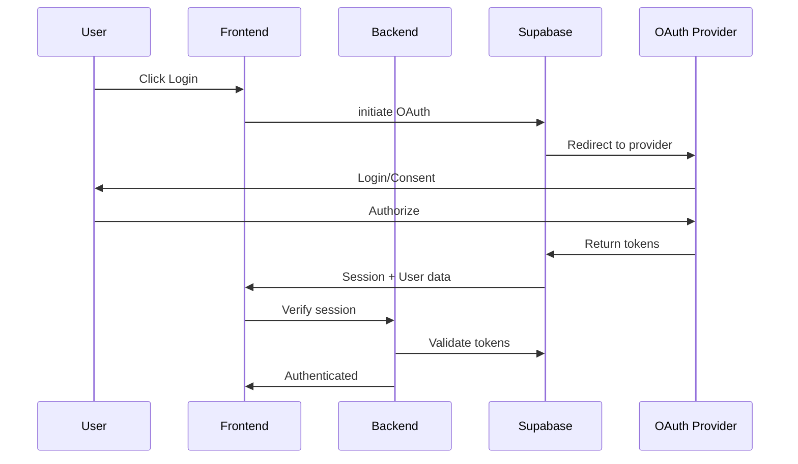
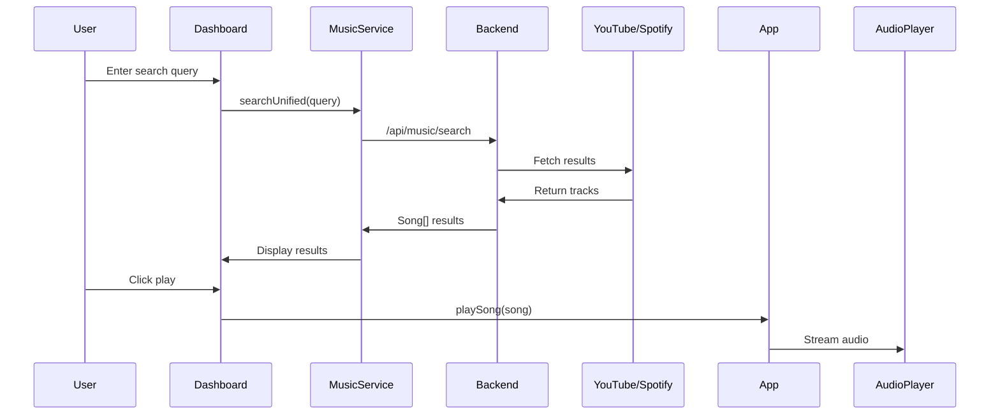
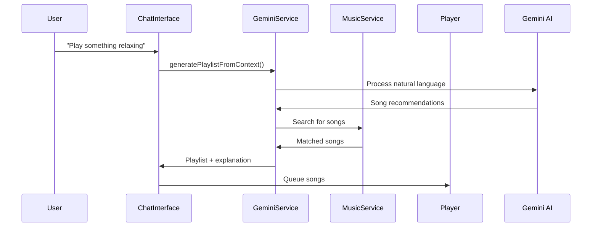

# Music Companion - Complete System Documentation

## 1. System Architecture Overview

Music Companion is a full-stack AI-powered music streaming and discovery platform built with modern web technologies.

### Architecture Diagram



---

### Technology Stack

| Layer | Technology |
|-------|------------|
| **Frontend** | React 18, TypeScript, Vite, TailwindCSS |
| **Backend** | Node.js, Express.js, Socket.IO |
| **Database** | Supabase (PostgreSQL) |
| **Storage** | Supabase Storage (music files) |
| **AI** | Google Gemini API |
| **Auth** | Supabase Auth (OAuth + Email) |
| **Deployment** | Vercel (Frontend), Railway (Backend), Docker |

---

### Database Schema



---

## 2. System Workflow

### User Authentication Flow



### Music Search & Playback Flow



### AI Music Generation Flow



---

## 3. Current Features

### Core Features

| Feature | Description | Components |
|---------|-------------|------------|
| **AI Chat Assistant** | Natural language music requests, mood-based recommendations | `ChatInterface.tsx`, `geminiService.ts` |
| **Live Voice Mode** | Real-time voice interaction with AI DJ | `LiveInterface.tsx`, `useLiveSession.ts` |
| **Smart Dashboard** | Personalized recommendations, mood tracking, quick actions | `Dashboard.tsx`, `MoodChart.tsx` |
| **Multi-Provider Search** | Unified search across YouTube, Spotify, Last.fm | `musicService.ts`, `music.ts` |
| **Music Player** | Full-featured player with EQ, sleep timer, visualizer | `MusicPlayer.tsx`, `MusicVisualizer.tsx` |
| **Offline Library** | Download songs, manage local + server + cloud storage | `OfflineLibrary.tsx`, `downloads.ts` |
| **Focus Mode** | Pomodoro timer with focus music, task management | `FocusMode.tsx`, `consultFocusAgent()` |

### Integration Features

| Integration | Status | Capabilities |
|-------------|--------|--------------|
| **Spotify** | User-linked | Playback control, library sync, recommendations |
| **Discord** | User-linked | Rich Presence, activity status |
| **Last.fm** | System-wide | Artist info, similar artists, scrobbling support |
| **YouTube** | System-wide | Search, audio streaming/download via yt-dlp |
| **Telegram** | User-linked | Bot notifications, remote control |
| **Google** | OAuth login | Authentication provider |

### Advanced Features

| Feature | Description |
|---------|-------------|
| **Smart Theme** | AI-driven UI theme changes based on music mood |
| **Artist Graph** | Visual relationship graph of related artists |
| **Music Trivia** | Interactive music knowledge games |
| **Arcade Mode** | Music-themed games and challenges |
| **Collaborative Playlists** | Real-time shared playlist editing |
| **Extensions** | Browser/VSCode extension support |
| **Developer API** | API keys, scopes, webhooks for third-party integration |
| **Radio Station** | AI-generated infinite radio based on seeds |
| **Sleep Timer** | Auto-pause with gradual fade out |

---

## 4. Areas for Improvement

### High Priority

> [!WARNING]
> **Critical Issues**

| Issue | Impact | Suggestion |
|-------|--------|------------|
| **YouTube Bot Detection** | Downloads frequently fail | Implement rotating proxies, add cookies support, consider YouTube Music API |
| **Token Refresh Reliability** | Spotify/OAuth tokens sometimes loop | Add exponential backoff, better error state handling |
| **Large App.tsx** | 1,357 lines, difficult to maintain | Split into smaller components, extract state management to Zustand/Redux |

### Medium Priority

> [!IMPORTANT]
> **Performance & UX Improvements**

| Area | Current State | Improvement |
|------|---------------|-------------|
| **State Management** | Prop drilling through App.tsx | Migrate to Zustand or Redux Toolkit |
| **Error Handling** | Inconsistent across components | Centralized error boundary with toast notifications |
| **Caching Strategy** | Basic in-memory cache | Implement React Query or SWR for server state |
| **Mobile Responsiveness** | Partial support | Full mobile-first redesign |
| **Accessibility** | Limited ARIA support | Add keyboard navigation, screen reader support |

### Low Priority

| Area | Suggestion |
|------|------------|
| **Testing** | Add E2E tests (Playwright exists but limited coverage) |
| **Documentation** | Add JSDoc comments, API documentation |
| **Internationalization** | i18n folder exists but not fully implemented |
| **PWA Features** | Enhanced offline support, push notifications |

---

## 5. Recommended Features to Add

### Tier 1: High-Value Additions

| Feature | Description | Complexity |
|---------|-------------|------------|
| **🎵 Audio Fingerprinting** | Identify songs via microphone (like Shazam) | High |
| **📊 Listening Analytics** | Weekly/monthly reports, trends, insights | Medium |
| **🎤 Lyrics Display** | Synchronized lyrics during playback | Medium |
| **👥 Social Features** | Follow users, share playlists, activity feed | High |
| **📱 Mobile App** | React Native companion app | High |

### Tier 2: Enhancement Features

| Feature | Description | Complexity |
|---------|-------------|------------|
| **🎧 Crossfade** | Smooth transitions between tracks | Low |
| **⏰ Smart Alarms** | Wake up to personalized music | Low |
| **🌐 Multi-Language** | Complete i18n implementation | Medium |
| **🎨 Custom Themes** | User-created theme editor | Medium |
| **📻 Podcast Support** | Podcast discovery and playback | Medium |
| **🔊 Audio Effects** | Reverb, bass boost, 3D audio | Medium |

### Tier 3: Future Vision

| Feature | Description |
|---------|-------------|
| **AI Voice Cloning** | Personalized AI DJ voice |
| **Concert Recommendations** | Local live music events based on taste |
| **Mood-Based Home Automation** | Smart home integration |
| **Collaborative Listening** | Real-time synchronized playback with friends |
| **Music Creation Tools** | Simple beat maker, remix tools |

---

## 6. File Structure Reference

```
music-companion/
├── App.tsx                 # Main application component
├── components/             # 38 UI components
│   ├── Dashboard.tsx       # Main dashboard
│   ├── ChatInterface.tsx   # AI chat
│   ├── LiveInterface.tsx   # Voice mode
│   ├── MusicPlayer.tsx     # Audio player
│   ├── OfflineLibrary.tsx  # Downloads manager
│   └── ...
├── hooks/                  # 15 custom hooks
│   ├── useSpotifyPlayer.ts
│   ├── useLiveSession.ts
│   └── ...
├── services/               # 13 frontend services
│   ├── geminiService.ts    # AI integration
│   ├── musicService.ts     # Unified search
│   └── ...
├── contexts/               # React context providers
├── backend/
│   └── src/
│       ├── routes/         # 7 API route modules
│       ├── services/       # 11 backend services
│       └── middleware/     # Rate limiting, auth
└── supabase/               # Database migrations
```

---

## Summary

Music Companion is a feature-rich, AI-powered music platform with strong foundations in:
- ✅ AI-driven music discovery (Gemini)
- ✅ Multi-provider search (YouTube, Spotify, Last.fm)
- ✅ Real-time collaboration (WebSocket)
- ✅ Offline capabilities (downloads, local storage)
- ✅ Extensive integrations (6+ services)

**Primary Focus Areas:**
1. Resolve YouTube download reliability
2. Refactor App.tsx for maintainability  
3. Improve mobile experience
4. Add listening analytics and social features
